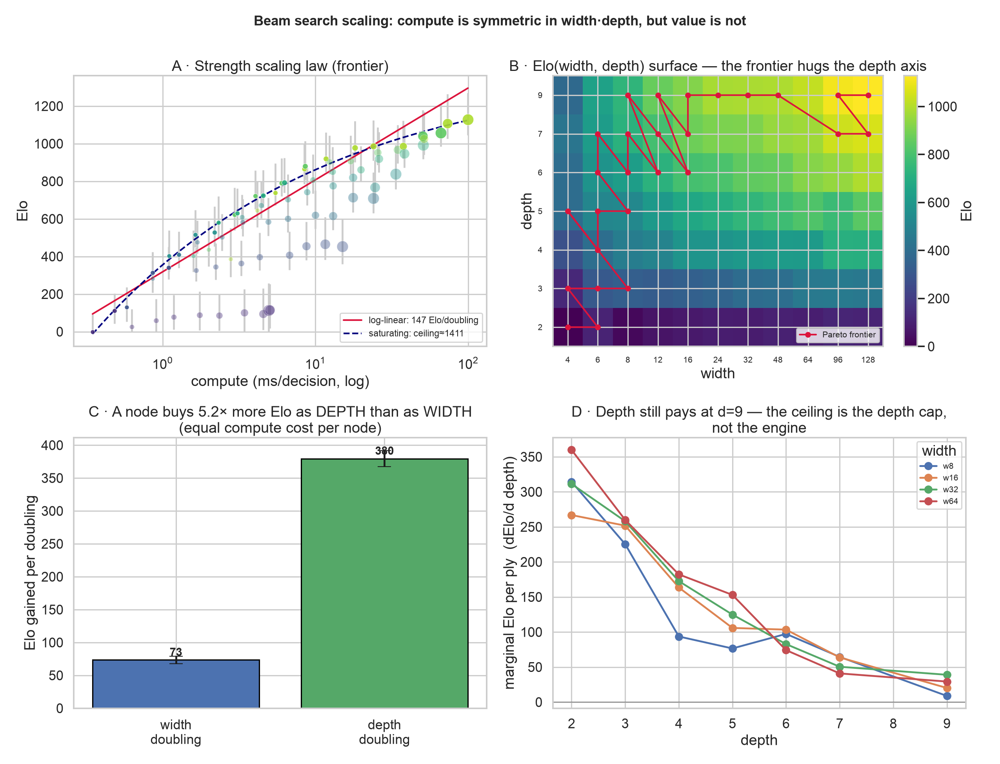

# Beam search-shape Pareto frontier — Elo vs compute

**Question.** Holding eval and sight constant, how much *playing strength* does each extra
node of beam search buy, and where is the knee? i.e. does a cheaper `(width, depth)` reach
near-champion strength at a fraction of the champion's per-decision compute?


## Setup

- **Family.** `BotSpec::tp_beam(width, depth).cc2(attack_tuned)` — the champion family,
  garbage-aware. Only `(width, depth)` varies; everything else is held constant, so the
  result is the pure search-shape frontier.
- **Grid.** widths `{4,6,8,12,16,24,32,48,64,96,128}` × depths `{2,3,4,5,6,7,9}` = **77 configs**.
- **Compute (x).** Median per-decision wall-time (native release) of one full
  `think_to_completion` over a fixed bank of 40 realistic mid-game states, plus the
  deterministic node count. Range: **0.35 ms (w4d2, 4 nodes) → 100 ms (w128d9, 972 nodes)**.
- **Elo (y).** Bradley–Terry MLE over a versus tournament's pairwise win/loss/draw matrix
  (258 matchups, **6,192 games**), anchored so the weakest config sits at 0. 95% CIs from a
  multinomial bootstrap.

### Conventions honored (the platform's, see `tetr_research` lib docs)

- **Arm-swap + CRN** — every pair plays each seed from both chairs; chair luck cancels.
- **Death decides; the cap tiebreak is biased** — games are made decisive by symmetric
  garbage **rain** (one line to both every 4 plies); a game that still reaches the ply cap
  with both alive is scored a **draw**, never by the anti-defensive net-attack tiebreak.
- **Determinism** — seeds drawn from a disjoint measurement region; every game is a pure
  function of `(spec, seed)`.
- **Self-bounding + checkpointed** — the runner honors a wall-clock budget and appends each
  finished matchup, so a truncated run still yields a connected graph.

## Finding

The frontier is steep then flat — **classic diminishing returns**.

- **The knee (Kneedle elbow) is `w16d7`: ~880 Elo at 8.6 ms — 11.6× less compute than the
  100 ms champion**, for −248 Elo.
- The **top ~250 Elo costs ~11× the compute**: the champion (`w128d9`, 1128 Elo) is the
  expensive last mile.
- **Depth is the efficient lever; width is the expensive one.** The frontier is dominated by
  high-depth / low-to-mid-width configs (`w6d7`, `w8d9`, `w12d9`, `w16d9`, …); low-depth
  configs (d2–d4) are dominated interior points. The cheapest path up the Elo ladder is to
  go *deeper* at modest width, then spend width only for the final climb at d9.
- The top-end configs (`w48d9`…`w128d9`) sit within overlapping CIs — they are genuinely
  hard to separate even under rain, so the last-mile Elo gaps are the noisiest.

## Scaling law (deep analysis)

`scaling_analysis.py` fits the laws behind the frontier (inverse-variance weighted by the
bootstrap CIs). 

**1. Compute is linear in nodes, and nodes = width·(depth−1).** `compute_ms ≈ 94 µs/node ·
nodes` (R²=0.98), `nodes ≈ width·(depth−1)` (TP pruning shaves the wide-deep corner ~5–40%).
**So width and depth cost exactly the same per node** — any Elo asymmetry between them is pure
*value*, not price.

**2. Strength saturates; it is not a constant Elo-per-doubling law.** A log-linear fit
(`147 Elo / compute-doubling`, R²=0.947) is a poor average. A saturating power law fits far
better — `Elo ≈ 1411 − 1056·ms^(−0.28)` (R²=0.993, ΔAIC ≈ −140). Marginal returns fall from
several-hundred Elo per compute-doubling at the cheap end to ~230 at the dear end.

**3. The headline: a node buys 5.2× more Elo as DEPTH than as WIDTH.** Decomposing the full
77-config surface, `Elo ≈ a + 73·log₂(width) + 380·log₂(depth)` (R²=0.948). Total nodes alone
explain only 76% of Elo (R²=0.761); the width/depth *split* explains 95% (ΔAIC ≈ −115) — so
**where** you spend a node matters far more than how many you spend. Iso-node confirms it
directly: at ~48 / 96 / 192 nodes (equal compute), reallocating from wide-shallow to
narrow-deep is worth **+458 to +545 Elo**. (E.g. `w16d7` and `w32d4` both cost 96 nodes /
~8 ms, but score 880 vs 602 Elo.)

**4. The ceiling is the depth cap, not the engine.** Past the knee the frontier is 62%
depth-9 configs — it can only buy width (the dear lever) because depth stops at 9. But the
per-ply value is *still positive* there (`+20…+40 Elo/ply` at d7→d9 for mid widths), so depth
has not saturated. The ~1411 "ceiling" is therefore a **lower bound at depth ≤ 9**; configs at
d12–d15 would extend the steep part of the law. **The cheapest way to a stronger bot is more
depth, not more width** — until you run out of depth, which is exactly where this grid stops.

> **Correction (regime split).** A follow-up expert review (`docs/research-directions.md`)
> showed the `5.2×` is an *average that masks a collapse*. Re-fitting the depth coefficient
> by regime — the bot has a 5-piece preview, so only ~6 plies are *concrete* and the rest are
> `SPEC_DECAY`-discounted speculation:
>
> | regime | depth Elo/doubling | depth/width |
> |---|---|---|
> | concrete (d ≤ 6) | **421** | **6.9×** |
> | speculative (d ≥ 7) | **199** | **1.9×** |
>
> Depth's dominance is almost entirely *inside the preview horizon*; past it, speculative
> depth is barely better than width (per-ply ΔElo falls to +20–40 at d7→d9). So the apparent
> "depth-cap ceiling" is more likely a **preview/speculation-quality ceiling** — and a deeper
> config (`w16d12`) may land *below* `w16d9`. The single experiment to settle it (register
> `w16d12/d15` past the grid wall — zero code, `max_depth` is an unbounded `u8`) is item **E1**
> of the roadmap.

## Reproduce

```bash
# 1. the tournament + compute (writes configs.csv, pairs.csv; ~40 min, checkpointed)
cargo run --release -p tetr-research --example elo_pareto -- full analysis/elo-pareto 2400
# (or `compute` for just the x-axis, fast)

# 2. fit Elo + plot
uv run analysis/elo-pareto/elo_pareto.py
```

Files: [`elo_pareto.rs`](../../crates/tetr-research/examples/elo_pareto.rs) (runner) ·
[`elo_pareto.py`](elo_pareto.py) (fit + plot) · `configs.csv` / `pairs.csv` (data) ·
`elo_pareto.png` (plot).
