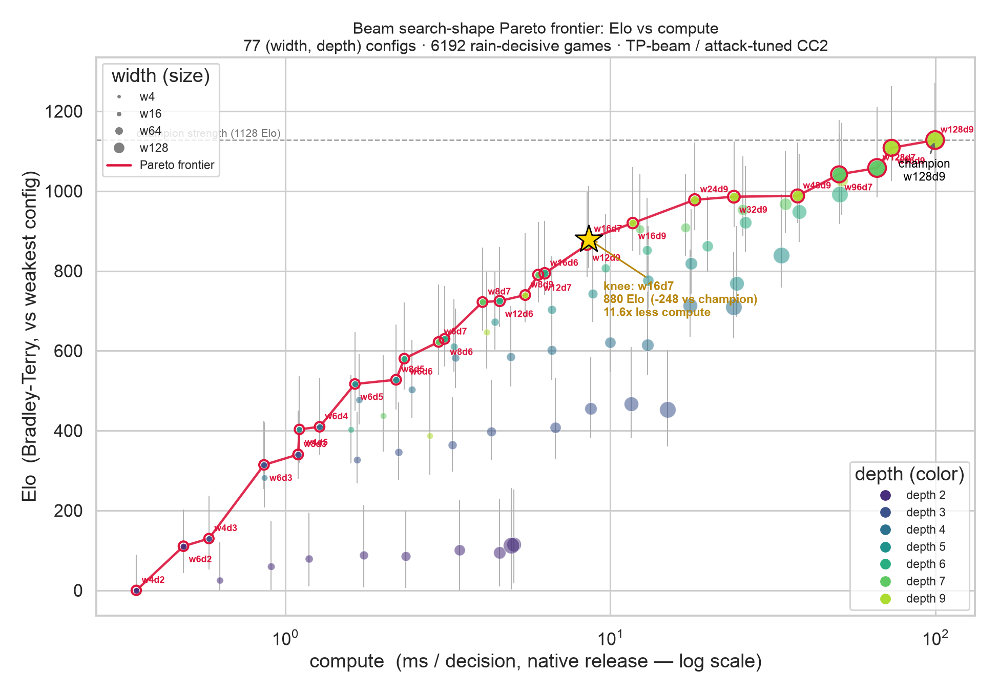

# Beam search-shape Pareto frontier — Elo vs compute

**Question.** Holding eval and sight constant, how much *playing strength* does each extra
node of beam search buy, and where is the knee? i.e. does a cheaper `(width, depth)` reach
near-champion strength at a fraction of the champion's per-decision compute?



## Setup

- **Family.** `BotSpec::tp_beam(width, depth).cc2(attack_tuned)` — the champion family,
  garbage-aware. Only `(width, depth)` varies; everything else is held constant, so the
  result is the pure search-shape frontier.
- **Grid.** widths `{4,6,8,12,16,24,32,48,64,96,128}` × depths `{2,3,4,5,6,7,9}` = **77 configs**.
- **Compute (x).** Median per-decision wall-time (native release) of one full
  `think_to_completion` over a fixed bank of 40 realistic mid-game states, plus the
  deterministic node count. Range: **0.35 ms (w4d2, 4 nodes) → 100 ms (w128d9, 972 nodes)**.
- **Elo (y).** Bradley–Terry MLE over a versus tournament's pairwise win/loss/draw matrix
  (258 matchups, **6,192 games**), anchored so the weakest config sits at 0. 95% CIs from a
  multinomial bootstrap.

### Conventions honored (the platform's, see `tetr_research` lib docs)

- **Arm-swap + CRN** — every pair plays each seed from both chairs; chair luck cancels.
- **Death decides; the cap tiebreak is biased** — games are made decisive by symmetric
  garbage **rain** (one line to both every 4 plies); a game that still reaches the ply cap
  with both alive is scored a **draw**, never by the anti-defensive net-attack tiebreak.
- **Determinism** — seeds drawn from a disjoint measurement region; every game is a pure
  function of `(spec, seed)`.
- **Self-bounding + checkpointed** — the runner honors a wall-clock budget and appends each
  finished matchup, so a truncated run still yields a connected graph.

## Finding

The frontier is steep then flat — **classic diminishing returns**.

- **The knee (Kneedle elbow) is `w16d7`: ~880 Elo at 8.6 ms — 11.6× less compute than the
  100 ms champion**, for −248 Elo.
- The **top ~250 Elo costs ~11× the compute**: the champion (`w128d9`, 1128 Elo) is the
  expensive last mile.
- **Depth is the efficient lever; width is the expensive one.** The frontier is dominated by
  high-depth / low-to-mid-width configs (`w6d7`, `w8d9`, `w12d9`, `w16d9`, …); low-depth
  configs (d2–d4) are dominated interior points. The cheapest path up the Elo ladder is to
  go *deeper* at modest width, then spend width only for the final climb at d9.
- The top-end configs (`w48d9`…`w128d9`) sit within overlapping CIs — they are genuinely
  hard to separate even under rain, so the last-mile Elo gaps are the noisiest.

## Reproduce

```bash
# 1. the tournament + compute (writes configs.csv, pairs.csv; ~40 min, checkpointed)
cargo run --release -p tetr-research --example elo_pareto -- full analysis/elo-pareto 2400
# (or `compute` for just the x-axis, fast)

# 2. fit Elo + plot
uv run analysis/elo-pareto/elo_pareto.py
```

Files: [`elo_pareto.rs`](../../crates/tetr-research/examples/elo_pareto.rs) (runner) ·
[`elo_pareto.py`](elo_pareto.py) (fit + plot) · `configs.csv` / `pairs.csv` (data) ·
`elo_pareto.png` (plot).
