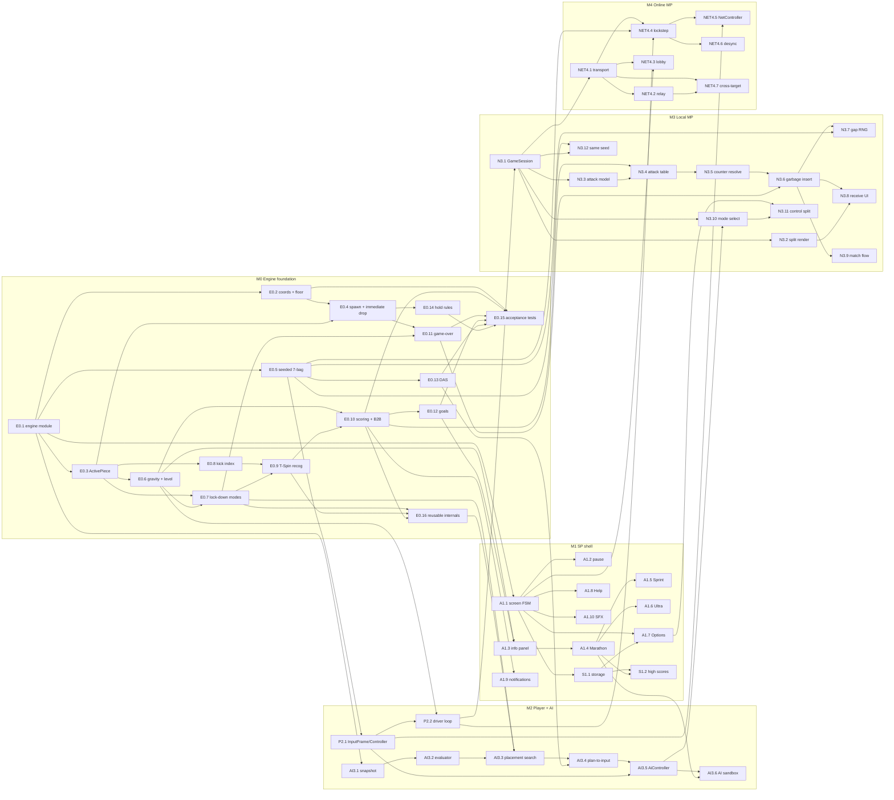

# Tetr Online Roadmap

End-state target: a build where any combination of human and AI players can play
against another combination of human and AI players, locally or online, on top of
a guideline-correct engine.

This document is the planning contract. It is written for the engineer who will
implement it (which is mostly going to be the same agent that wrote it) so it is
biased toward concreteness over prose.

---

## 1. Vision and success criteria

A version is "shippable" against this roadmap when all of the following are true:

1. The single-player engine passes the acceptance tests in `reference_guideline.md`
   section 25.
2. A bot can play the engine through the same input surface as a human player.
3. Two players (any mix of human/AI) can play head-to-head on one machine, with
   spec-correct attack/counter-attack/garbage and a winner declaration.
4. Two players (any mix of human/AI) can play head-to-head over a network, with
   deterministic, fair piece order and bounded latency.
5. The build runs both natively and on the existing Trunk-based web target.

Stretch:

* 3-4 player free-for-all and 2v2.
* Spectators and replays.
* Original assets so we can publish without third-party SFX.

---

## 2. Current state, brutally honest

What works:

* Pure single-player loop with falling, locking, hard drop, hold, ghost, line
  clears.
* SRS five-test kick tables for J/L/S/T/Z and I.
* 7-bag generator (not seedable).
* 10x40 logical board with 10x20 visible.
* Score/B2B-ish scoring with combo, T-Spin recognition by last rotation event.
* Bevy UI: Next preview (6), Hold preview, score/lines text, lock-down bar.
* Game-Over screen and asset loading.

What is structurally in the way:

* `core::Board` and `core::Piece` are Bevy `Component`s. Engine and renderer are
  fused. Cannot be re-instantiated per-player, cannot be unit-simulated cheaply,
  cannot be lockstep-stepped from a network input stream.
* `LevelConfig` mixes rendering (block_size, preview_scale) and simulation
  (durations). Multiplayer needs per-player sim configs.
* No `ActivePiece` aggregate. T-Spin recognition state, lock budget, kick index,
  lowest-row-reached, hold-used-this-piece, last-action-was-rotate are spread
  across components and event payloads.
* `PieceGenerator` calls `rand::rng()` directly. Not seedable -> not
  deterministic -> no lockstep MP.
* `Board::get_cell_kind` does not treat `y < 0` as a floor.
* No menus beyond Game Over. Single hard-coded `InGame` state.
* No level/goal/variant/timer state.
* No multiplayer/network/AI scaffolding.

Implication: a meaningful chunk of the roadmap is foundational refactoring
*before* feature work. We pay it once.

---

## 3. Guiding principles and architectural decisions

These are decisions to lock in before significant work begins. Each one removes
ambiguity that would otherwise block multiple downstream tasks.

### ADR-1: Pure engine module, no Bevy in the simulation core

* Create `src/engine/` containing `Board`, `Piece`, `ActivePiece`, `Bag`, `Srs`,
  `LockDown`, `TSpin`, `Score`, `Gravity`, `Variants`, `Engine`.
* No `Component`, `Resource`, `Transform`, or Bevy types inside `engine/`.
* `engine::Engine` exposes a fixed-step API:
  * `Engine::new(config: EngineConfig, seed: u64) -> Engine`
  * `Engine::step(&mut self, input: InputFrame) -> Vec<EngineEvent>`
  * `Engine::snapshot(&self) -> EngineSnapshot`
* Bevy lives in `src/app/` and `src/render/` and only consumes engine snapshots
  and emits `InputFrame`s.

Why: enables AI evaluation, headless tests, and lockstep multiplayer.

### ADR-2: Coordinate system

* Internally use spec coordinates: `x: 1..=10`, `y: 1..=40`, with `(1, 1)` the
  bottom-left visible cell. Render layer translates to screen pixels.
* All rule logic, kick tables, and tests use these coordinates verbatim from the
  spec to remove translation bugs.

### ADR-3: Determinism contract

* Engine is a pure function of `(seed, sequence_of_InputFrames)`.
* RNG is `rand_xoshiro::Xoshiro256PlusPlus` (or `rand_chacha`) seeded from a
  `u64`.
* Wall-clock time enters the engine only as a fixed timestep `dt` inside an
  `InputFrame`. The Bevy app schedules engine steps at a fixed sim rate (e.g.
  60 Hz) and accumulates leftover time.
* Forbidden in `engine/`: `std::time::*`, `rand::rng()`, `OnceCell` of any
  global, threading.

Why: lockstep MP, replays, deterministic AI evaluation, deterministic tests.

### ADR-4: Player abstraction

* `trait PlayerController { fn poll(&mut self, snapshot: &EngineSnapshot) -> InputFrame; }`
* Implementations: `KeyboardController`, `AiController`, `NetworkController`,
  `ReplayController`.
* Multiplayer is "N engines + N controllers stepped in lockstep".

### ADR-5: Multiplayer transport

* Authoritative model: deterministic lockstep with input forwarding. Each client
  runs all engines locally; only inputs cross the wire.
* Phase 1 transport: WebSocket via a tiny Rust relay server (works native and
  WASM). WebRTC P2P later if we want to drop the relay.
* Latency strategy: input delay (e.g. 3-5 frames at 60 Hz) before rollback.
  Rollback is M5+ if needed.

### ADR-6: Module layout (target)

```
src/
  engine/        (pure simulation; no Bevy)
  ai/            (bots; depends on engine only)
  net/           (transport, lockstep; depends on engine + serde)
  player/        (PlayerController impls; bridges input to engine)
  session/       (GameSession with N engines + controllers + attack pipeline)
  app/           (Bevy app, screens, menus, state machine)
  render/        (Bevy systems that consume EngineSnapshot)
  audio/         (SFX, music)
  storage/       (high scores, options persistence)
```

The current `src/core/` becomes `src/engine/`. The current `src/level/` is
split: simulation state moves into `engine/`/`session/`; rendering and input
glue stay in `app/`/`render/`/`player/`.

### ADR-7: Keep the door open for a placement-level interface

* The engine will be designed so that lock, line clear, T-spin classification,
  scoring, and attack computation are callable both from the per-frame loop and
  from a future placement-level entry point. No rule code may assume "input came
  from an `InputFrame`".
* We do not build the placement API or an RL `Env` trait now. We just refuse to
  paint ourselves into a corner.
* Likely first internal consumer is the AI placement search (AI3.3); first
  external consumer would be a future training environment or MCTS-style search.
* When we do build it, the shape is roughly: `engine.legal_placements()`,
  `engine.commit_placement(action)`, `engine.snapshot()/restore()`. See
  section 10 for the deferred work.

Why now: pulling a clean placement API out of an engine that wasn't built for it
later is much more expensive than leaving the seams in place from the start.

---

## 4. Milestones

Each task has: ID, title, why, deps, exit criteria, t-shirt size
(`XS<=0.5d`, `S<=1d`, `M<=3d`, `L<=1w`, `XL>1w`).

### M0. Engine foundation (must come first)

Goal: pure, deterministic, spec-correct engine with full acceptance tests.

* **E0.1 Carve out `engine/` module** [M]
  * Why: every later task depends on a Bevy-free simulation core.
  * Move `core/board.rs`, `core/pieces.rs`, `core/generator.rs`,
    `core/constants.rs` into `engine/`. Strip `Component`/`Transform`.
  * Add `engine::Engine`, `EngineConfig`, `EngineSnapshot`, `EngineEvent`,
    `InputFrame` skeletons.
  * Deps: none.
  * Exit: `cargo test -p engine` (or feature-gated) passes; renderer compiles
    against the new types via adapters.

* **E0.2 Spec-aligned coordinates and floor collision** [S]
  * Why: foundational correctness. Fixes Ghost/HardDrop/Gravity edge cases.
  * Switch to `1..=10 x 1..=40`. Treat `y < 1` and `x outside 1..=10` as
    blocking. Treat `y > 40` as Top-Out trigger.
  * Deps: E0.1.
  * Exit: unit tests for collision boundary cases pass; ghost cannot exit floor
    on empty board.

* **E0.3 `ActivePiece` aggregate** [M]
  * Why: required for T-Spin Point-5 override, Extended Lock budget, Hold rules.
  * Fields per spec section 2.4: `type, facing, origin, lockTimer,
    lockTimerActive, landed, lowestYReached, groundedMoveRotateCountSinceLowest,
    holdUsedOnThisPiece, lastSuccessfulAction, lastRotationDirection,
    lastRotationKickIndex, usedKick5IntoTSlot`.
  * Deps: E0.1.
  * Exit: state transitions covered by unit tests.

* **E0.4 Spawn cells and immediate-drop rule** [S]
  * Why: spec invariant; fixes Block-Out timing.
  * Implement exact spawn per section 2.3, Block-Out check before drop, then
    one-row immediate drop if free.
  * Deps: E0.2, E0.3.
  * Exit: tests for each piece's spawn cells and the "blocked-below skips drop"
    case pass.

* **E0.5 Seedable seven-bag** [S]
  * Why: determinism contract (ADR-3) and MP fairness.
  * Replace `rand::rng()` with injected `Rng` seeded from `EngineConfig.seed`.
  * Deps: E0.1.
  * Exit: same seed -> identical 1000-piece sequence in tests.

* **E0.6 Gravity and level system** [M]
  * Why: scoring depends on Level; fall speed must follow spec formula.
  * Implement `fallSpeed(level)` table, soft drop = `fallSpeed/20`, row-by-row
    gravity that handles multiple rows per tick.
  * Deps: E0.3.
  * Exit: timing tests at L1, L8, L15 within tolerance.

* **E0.7 Lock-down modes (Extended/Infinite/Classic)** [M]
  * Why: spec defaults Extended; affects every placement.
  * Implement 0.5s timer, 15-action budget for Extended with lowest-row reset,
    Infinite (always reset), Classic (only fall reset). Selectable in config.
  * Deps: E0.3, E0.6.
  * Exit: section 25.6 acceptance tests pass.

* **E0.8 SRS kick index tracking** [XS]
  * Why: T-Spin Point-5 needs kick index 5 preserved on the piece.
  * Persist successful kick index 1..5 onto `ActivePiece` after each rotation.
  * Deps: E0.3.
  * Exit: rotation tests assert correct index.

* **E0.9 T-Spin / Mini T-Spin recognition** [M]
  * Why: scoring + multiplayer attack tables depend on it.
  * Implement A/B/C/D corner labels by facing, full-vs-mini classification, and
    Point-5 override. Include `usedKick5IntoTSlot` carry-over.
  * Deps: E0.3, E0.7, E0.8.
  * Exit: section 25.7 tests pass; positive and negative cases.

* **E0.10 Scoring and B2B exact** [M]
  * Why: must match spec to within a point for replays and parity tests.
  * Implement section 13 exactly: per-level multipliers, B2B chain qualification,
    zero-line-T-Spin preservation, drop scores. Remove unspec'd combo bonus or
    gate it behind a `Scoring::Combo` opt-in.
  * Deps: E0.6, E0.9.
  * Exit: section 25.8 example totals 5400 at L1; arithmetic property tests.

* **E0.11 Game-over conditions** [S]
  * Why: required for any match end and for Top-Out from garbage later.
  * Block Out at spawn (E0.4), Lock Out post-lock, Top Out after garbage push.
  * Deps: E0.4, E0.7.
  * Exit: section 25.10 tests pass.

* **E0.12 Goal systems (Fixed and Variable)** [S]
  * Why: variants depend on goal advancement.
  * Implement Fixed (10 lines/level, prorated start) and Variable (`Level * 5`
    awarded units) per spec.
  * Deps: E0.10.
  * Exit: section 25.9 tests pass.

* **E0.13 DAS / auto-shift** [S]
  * Why: feel; also a deterministic input requirement for replays.
  * Initial 0.3s delay, ~50ms repeat, opposite-direction restart, carry-over
    across pieces. Live in `player::input` (not engine), but the engine must
    accept frame-tagged inputs.
  * Deps: E0.5 (so `InputFrame` exists), ADR-3.
  * Exit: section 25.3 tests pass via simulated key streams.

* **E0.14 Hold queue rules tightened** [XS]
  * Why: spec requires North Facing on swap and one Hold per Lock Down; current
    code keeps prior rotation.
  * Always reset rotation to North on swap. Re-check Block-Out on swapped piece.
  * Deps: E0.3, E0.4.
  * Exit: tests cover swap, double-swap blocked, swap-into-blocked = no swap.

* **E0.15 Acceptance test suite** [L]
  * Why: regression net for everything below.
  * Translate `reference_guideline.md` section 25 into Rust integration tests
    under `engine/tests/`.
  * Deps: E0.2..E0.14.
  * Exit: all suites green; CI runs them.

* **E0.16 Internals reusable from a placement entry point** [S]
  * Why: ADR-7. Make sure rule primitives are not entangled with the per-frame
    loop, so a future `commit_placement` (and the AI placement search in AI3.3)
    can reuse them without surgery.
  * Concretely: `lock_and_clear(active, board) -> LockOutcome`,
    `classify_tspin(active, board) -> TSpinKind`, `score_action(...)`,
    `apply_attack(...)` should be free functions or methods that take state
    explicitly and don't reach into a "current input frame" or "current tick".
  * Deps: E0.7, E0.9, E0.10.
  * Exit: AI3.3 placement search consumes the same primitives the frame loop
    does; no duplicated rule code.

### M1. Single-player playable shell

Goal: a polished single-player game with Marathon/Sprint/Ultra and menus.

* **A1.1 Screen state machine** [M]
  * States: `Loading -> Title -> MainMenu -> ModeSelect -> Options/Help/HighScores -> Playing -> Paused -> GameOver`.
  * Deps: E0.1 (engine ready to be wrapped).
  * Exit: keyboard navigation across all screens.

* **A1.2 Pause** [S]
  * Freeze sim, hide Matrix/Next/Hold contents, show "Pause" overlay.
  * Deps: A1.1.

* **A1.3 Game info panel** [S]
  * Level, Goal, Time, Lines, Score, High Score, optional TPM/LPM.
  * Deps: E0.6, E0.10, E0.12.

* **A1.4 Variant: Marathon** [S]
  * Levels advance by selected goal system; ends at L15 or Game Over.
  * Deps: A1.3.

* **A1.5 Variant: Sprint (40 lines)** [S]
  * Configurable line target, completion-time-primary high score.
  * Deps: A1.4.

* **A1.6 Variant: Ultra (timed)** [S]
  * Configurable time limit (default 2 min); score-primary high score.
  * Deps: A1.4.

* **A1.7 Options menu** [M]
  * Next count 1..6, Hold on/off, Ghost on/off, Lock-down mode, music/SFX
    volume and toggles, control remap.
  * Persist via `storage/options.rs`.
  * Deps: A1.1, S1.1 (storage, see below).

* **A1.8 Help screen** [S]
  * Use spec terminology (Matrix, Tetrimino, Mino, Lock Down, etc.).
  * Deps: A1.1.

* **A1.9 Action notifications and visual polish** [M]
  * Tetris/T-Spin/B2B labels per section 19.2. Line-clear flash. Hard-drop trail.
  * Deps: E0.10.

* **A1.10 Min SFX completion** [XS]
  * Add move-left/right and game-over and rotation/movement-failure cues.
  * Deps: A1.1.

* **S1.1 Storage layer** [S]
  * Native: `directories` crate; Web: `web-sys` localStorage. Single trait.
  * Deps: A1.1.

* **S1.2 High score tables** [S]
  * Top 10 per variant, qualifying entry flow, persistence.
  * Deps: S1.1, A1.4..A1.6.

### M2. Player abstraction and AI

Goal: same engine driven by either keyboard, AI, network, or replay.

* **P2.1 `InputFrame` and `PlayerController` trait** [S]
  * Define `InputFrame { dt, left, right, soft, hard, ccw, cw, hold, pause }`.
  * Define `PlayerController` per ADR-4.
  * Deps: E0.5.
  * Exit: existing keyboard handling reimplemented as `KeyboardController`.

* **P2.2 Engine driver loop** [S]
  * Bevy system steps each engine via its controller at fixed sim rate.
  * Deps: P2.1, E0.6.
  * Exit: sim runs decoupled from frame rate; `cargo run` plays as before.

* **AI3.1 Engine snapshot for AI** [S]
  * `EngineSnapshot` includes board cells, active piece, hold, next queue, score
    state, attack queues. Cheap to clone.
  * Deps: E0.1.

* **AI3.2 Heuristic evaluator** [M]
  * Score a board by holes, bumpiness, aggregate height, well depth, line-clear
    potential, T-Spin opportunities. Tunable weights.
  * Deps: AI3.1.

* **AI3.3 Placement search** [M]
  * Enumerate reachable final placements (BFS in (x, y, facing)) for the active
    piece (and optionally with hold). Pick best by AI3.2 eval. Built on top of
    the reusable engine primitives from E0.16; a future placement-level public
    API (section 10) would expose roughly this code.
  * Deps: AI3.2, E0.7, E0.16.

* **AI3.4 Plan-to-input translator** [S]
  * Convert chosen placement into a sequence of `InputFrame`s (rotations, lateral
    moves, optional hold, hard drop). Respect DAS (E0.13).
  * Deps: AI3.3, E0.13.

* **AI3.5 `AiController`** [S]
  * Implements `PlayerController` by replanning on relevant snapshot deltas
    (new piece, garbage, hold). Configurable think-time and error rate.
  * Deps: AI3.4, P2.1.

* **AI3.6 AI sandbox mode** [XS]
  * Single-player view that lets the AI play; useful for tuning.
  * Deps: AI3.5, A1.4.

### M3. Local multiplayer (1v1 same machine)

Goal: human/AI vs human/AI on one process with correct attack pipeline.

* **N3.1 `GameSession` with N engines** [M]
  * Owns: `Vec<EngineInstance>`, `Vec<Box<dyn PlayerController>>`,
    `MatchConfig`, attack router, RNG seed.
  * Deps: P2.2.

* **N3.2 Side-by-side rendering** [M]
  * Per-player Matrix, Hold, Next, info column, receiving queue. Layout for 2.
  * Deps: N3.1.

* **N3.3 Attack pipeline data model** [S]
  * `AttackEvent { src, dst, lines, kind, b2b_bonus }`. Per-player `IncomingQueue`.
  * Deps: N3.1.

* **N3.4 Attack table and outgoing computation** [S]
  * Section 22.4 lines per action, +1 for B2B.
  * Deps: E0.10, N3.3.

* **N3.5 Counter-attack resolution** [S]
  * Section 22.5: net = outgoing - incoming; route accordingly.
  * Deps: N3.4.

* **N3.6 Garbage insertion** [M]
  * Push existing blocks up, insert N rows from bottom with the chosen gap.
  * Trigger Top Out via E0.11 if blocks pushed above row 40.
  * Deps: N3.5, E0.11.

* **N3.7 Broken-line gap RNG** [S]
  * Section 22.3: change gap every 8 appeared lines; deterministic from session
    seed.
  * Deps: N3.6, E0.5.

* **N3.8 Receiving queue UI** [S]
  * Visual bar; updates only on incoming insert.
  * Deps: N3.6, N3.2.

* **N3.9 Match flow and win condition** [S]
  * First Top-Out loses; show match end screen with stats; rematch option.
  * Deps: N3.6.

* **N3.10 Multiplayer mode select** [S]
  * Pick controllers per slot: human, AI (with difficulty). Pick variant.
  * Deps: N3.1, AI3.5, A1.7.

* **N3.11 Local control split** [XS]
  * Default key maps for P1 and P2; remap via Options.
  * Deps: A1.7, N3.10.

* **N3.12 Same-seed piece order** [XS]
  * Both engines in a session share the bag seed.
  * Deps: E0.5, N3.1.

### M4. Networked multiplayer

Goal: human/AI vs human/AI across the internet.

* **NET4.1 Transport abstraction** [M]
  * `trait Transport { send(&Msg); recv() -> Vec<Msg>; }` with WebSocket impl
    (`tokio-tungstenite` native; `gloo-net` web).
  * Deps: ADR-5.

* **NET4.2 Tiny relay server** [M]
  * Rust binary in `crates/relay/` (or sibling repo) that pairs clients into
    rooms and forwards messages. No game logic on server.
  * Deps: NET4.1.

* **NET4.3 Lobby and room codes** [S]
  * Create-room / join-by-code UI, basic ready check.
  * Deps: NET4.1, A1.1.

* **NET4.4 Lockstep input exchange** [L]
  * Fixed sim rate with input delay of K frames. Frame-tagged inputs serialized
    with `serde` + `bincode`. Engines on both sides simulate identically.
  * Deps: NET4.1, P2.2, E0.5, ADR-3.

* **NET4.5 Network player controller** [S]
  * `NetworkController` reads the next remote input for the current frame.
  * Deps: NET4.4, P2.1.

* **NET4.6 Disconnect / timeout / desync detection** [M]
  * Periodic state hash exchange; on mismatch, end match cleanly with logs.
  * Deps: NET4.4.

* **NET4.7 Cross-target build (native + WASM client; native server)** [M]
  * Verify Trunk web build and `cargo run --bin tetr_online` both connect to the
    relay.
  * Deps: NET4.1, NET4.2.

### M5. Polish and ship

* **POL5.1 Original SFX/music/textures** [L]
* **POL5.2 Replay record/playback** [M]
  * Just store seed + per-frame inputs; replay through `ReplayController`.
  * Deps: NET4.4 or E0.5 + P2.1.
* **POL5.3 Spectator mode** [M] — depends on POL5.2 or NET4.4.
* **POL5.4 Telemetry/logging for online matches** [S]
* **POL5.5 WASM size optimization pass** [M]
* **POL5.6 Tutorial / first-run experience** [M]
* **POL5.7 4-player FFA and 2v2** [L] — depends on M3 + NET4.4 generalization.

---

## 5. Dependency graph



---

## 6. Critical path to "human/AI vs human/AI"

Two ship lines, deliver in this order:

### Local MP first (recommended MVP)

```
E0.1 -> E0.3 -> E0.4 -> E0.5 -> E0.7 -> E0.9 -> E0.10 -> E0.11
     -> P2.1 -> P2.2 -> AI3.1 -> AI3.2 -> AI3.3 -> AI3.4 -> AI3.5
     -> N3.1 -> N3.3 -> N3.4 -> N3.5 -> N3.6 -> N3.7 -> N3.9 -> N3.10
```

E0.2, E0.6, E0.8, E0.12, E0.13, E0.14, E0.15, A1.* and N3.2/N3.8/N3.11/N3.12
parallelize alongside the critical path.

This gives a complete local 1v1 with AI. Ship-quality MVP.

### Online MP extension

```
(local MP critical path) -> NET4.1 -> NET4.2 -> NET4.4 -> NET4.5 -> NET4.7
```

NET4.3 (lobby) and NET4.6 (desync detection) parallelize. Lockstep MP only
works if E0.5 (seeded RNG) and ADR-3 (determinism) are held.

---

## 7. Phasing recommendation

Sequencing optimized for "playable thing every milestone".

* **Phase 1 (M0 essentials)**: E0.1, E0.2, E0.3, E0.4, E0.5, E0.7, E0.8, E0.9,
  E0.10, E0.11, E0.13, E0.14. Defer E0.6 level scaling, E0.12 goals, E0.15
  acceptance suite to phase 2. Visible deliverable: same single-player as today
  but on the new pure engine, with all spec-compliant placement rules.

* **Phase 2 (M0 finish + M1)**: E0.6, E0.12, E0.15. Then A1.1..A1.10 and S1.*.
  Visible deliverable: full single-player with Marathon/Sprint/Ultra, options,
  high scores, pause, action notifications.

* **Phase 3 (M2)**: P2.1, P2.2, AI3.1..AI3.6. Visible deliverable: AI sandbox
  mode where you watch a bot play any single-player variant.

* **Phase 4 (M3)**: N3.* in dependency order. Visible deliverable: local
  human-vs-AI and human-vs-human matches with garbage. **This is the first
  release that satisfies the user goal in the local sense.**

* **Phase 5 (M4)**: NET4.*. Visible deliverable: same matches over the internet
  via a relay.

* **Phase 6 (M5)**: polish, replays, originals, larger formats.

---

## 8. Risks and mitigations

* **R1. Engine refactor scope creep.** Pure-engine carve-out (E0.1) will touch
  every file under `src/level/`. Mitigation: do E0.1 as a single PR that only
  moves and adapts types, with no behavior changes. Tests must keep passing.

* **R2. Determinism leaks.** Floats, hashmap iteration order, `OnceCell`,
  thread-local RNG can break lockstep silently. Mitigation: ADR-3 forbids these
  in `engine/`; add a CI check that grep-bans `rand::rng`, `Instant::now`,
  `SystemTime::now` in `src/engine/`.

* **R3. AI think-time pauses gameplay.** Synchronous evaluation of all
  placements can stall a frame. Mitigation: budget AI evaluation per step;
  evaluate incrementally across frames or on a worker thread native-side. Web
  side keep evaluator cheap or use a coarse heuristic.

* **R4. Rotation / kick edge cases.** SRS test 5 and floor/well kicks have many
  off-by-one traps. Mitigation: E0.15 must port the spec's section 25.5 cases
  before E0.9.

* **R5. WASM size and network on web.** Bevy WASM is already huge (70 MB in
  `dist/`); adding network increases attack surface. Mitigation: POL5.5 size
  pass; pin Bevy default-features off as already done; consider `wee_alloc`.

* **R6. Lockstep latency feel.** Input delay of 5 frames at 60 Hz = ~83 ms,
  acceptable for casual MP but rough for high-level play. Mitigation: leave
  rollback as a known M5+ task; document the tradeoff.

* **R7. AI exploits engine bugs.** Bot can find non-spec behavior the engine
  exposes. Mitigation: E0.15 acceptance suite as a regression net before
  introducing AI.

* **R8. Asset licensing.** Current SFX from Techmino must not ship in a public
  release. Mitigation: POL5.1 in M5 before any public release tag; gate release
  builds on absence of Techmino files.

* **R9. Frame and placement APIs drift if both ever exist.** ADR-7 leaves the
  door open for a future placement-level API, which would mean two ways to
  advance the engine. Mitigation: E0.16 keeps rule primitives shared so a
  placement entry point would be a thin wrapper over the same code; if/when we
  add it, also add a property test that any reachable placement reaches the
  same post-state via either path.

---

## 9. Done checklist for the user-stated end goal

The user-stated end goal is "human/AI player can play with another human/AI
player". That is satisfied by the union of M0 essentials + M2 + M3. Concretely:

* [ ] Pure deterministic engine with seeded bag (E0.1, E0.3, E0.5).
* [ ] Spec-correct placement, lock, T-Spin, scoring, game-over (E0.4, E0.7,
      E0.9, E0.10, E0.11).
* [ ] Player abstraction with Keyboard and AI controllers (P2.1, P2.2, AI3.5).
* [ ] `GameSession` with two engines, attack pipeline, garbage insertion, win
      condition (N3.1, N3.4, N3.5, N3.6, N3.9).
* [ ] Mode select to assign human/AI to each slot (N3.10).
* [ ] Side-by-side rendering and controls split (N3.2, N3.11).
* [ ] Optional online: NET4.1, NET4.2, NET4.4, NET4.5, NET4.7.

When those are checked, the milestone is met.

---

## 10. Deferred: placement API and RL environment

Out of scope for the milestones above. Captured here so we don't forget what
ADR-7 and E0.16 are leaving room for, and so we don't accidentally rule it out
during the M0 refactor.

When we want a strong learned bot, fast self-play, MCTS-style search, or a
training environment we can hand to a Python ML stack, the natural additions
are:

* A public placement-level entry point on `Engine`, e.g.
  `legal_placements()`, `commit_placement(action) -> PlacementOutcome`,
  `snapshot()/restore()`. Implemented as a wrapper over the primitives from
  E0.16; no second copy of the rules.
* An `Env`-style trait (single-player, vs-bot, self-play) with `reset(seed)`,
  `step(action)`, `legal_actions()`, `observation()`. Useful both for RL and
  for `cargo bench`-style throughput tests.
* Vectorized batch stepping for parallel environments.
* A serialization protocol for an external training process (PyO3 binding, or
  just JSON over stdio) — we'd choose later based on what stack we use.
* A reference learned policy (PPO / AlphaZero-lite / behavior cloning from
  search) only as a research deliverable, not a shipping requirement.

Design constraints to honor now so this stays cheap later:

* Keep rule code in free functions or methods that take state explicitly
  (E0.16). No "current input frame" or "current tick" singletons inside the
  engine.
* Keep `EngineSnapshot` cheap to clone (favor `Vec<u8>` cells, fixed-size
  arrays for queues, no `Arc`/`Rc` of mutable state).
* Keep `EngineConfig` and per-engine state separate from `LevelConfig` (which
  carries rendering knobs).
* Don't wire RNG through Bevy `Resource`s; thread it as a field of the engine.

When this work actually starts, lift it into a real milestone with deps and
exit criteria. Until then it's just an open door.
